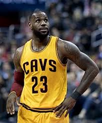
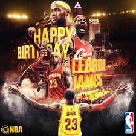

  

    <h1><a href="index.html" title="LeBron James" id="logo">LeBron James</a></h1>
    

      <ul><li><a href="about.html" title="高中">高中時期</a></li><li><a href="menu.html" title="職業生涯">職業生涯</a></li><li><a href="news.html" title="最新消息">News</a></li><li><a href="booking.html" title="線上訂位">Booking</a></li><li><a href="contact.html" title="聯絡我們">Contact us</a></li><li class="home"><a href="index.html" title="回首頁">Home</a></li></ul>
    

  

  

    <ul class="bxslider">
      <li></li>
      <li></li>
      <li></li>
    </ul>
  

<h2>初中籃球生涯</h2>
雷霸龍·詹姆斯早在初中時期，教練帶他參加美國業餘JJ聯合會（The Amateur JJ Union）。雷霸龍在比賽中表現崔越，被稱為是該賽事中「最厲害的球員」。雷霸龍的球隊也在他的帶領下一路披荊斬棘，來到了決賽。但可惜的是，雷霸龍錯過絕殺，他的球隊屈居亞軍。在這次旅行中，雷霸龍便決定立志進入NBA，並成為最強的球員。

<h2>高中籃球生涯</h2>
雷霸龍就讀於天主教會開辦的學校聖文森及聖瑪麗高中，一年級時，以21分6籃板，帶領聖文森及聖瑪麗高中（St.Vincent-St.Mary）以27勝0敗的巨大優勢贏得了俄亥俄州三級聯賽冠軍（Ohio Division III State Champion）。

在高中的第二年，Romeo也加入了這支球隊。他與雷霸龍和他的小夥伴們不同，他與他們很疏遠。跟雷霸龍和他的夥伴們互相扶持不同，Romeo不喜歡關心別人。在這一年，雷霸龍平均拿下25.2分和7.2個籃板，聖文森及聖瑪麗高中以26勝1負的戰績衛冕了州冠軍，由於雷霸龍的傑出表現，雷霸龍獲選為俄亥俄州籃球先生（Ohio's Mr. Basketball）及USA Today選出的高中全美第一隊。

在高中的第三年，雷霸龍成為第一位登上Sports Illustrated封面的高中籃球員，並以29分8.3個籃板5.7次助攻3.3個抄截的成績蟬聯俄亥俄州籃球先生及USA Today高中全美第一隊，並且成為第一位得到Gatorade National Player of the Year Award的高三學生，聖文森及聖瑪麗高中本季拿到23勝4負的成績，卻在二級聯賽冠軍賽（Ohio Division III State Championship）時，輸給了Roger Bacon。

雷霸龍在經歷了高中三年級與Roger Bacon的比賽的失利，所在的聖文森及聖瑪麗高中球隊僅在當時的＂全美高中男子籃球隊Top 25＂中排名第23。為了改變這樣的窘境，球隊開始在全國範圍內與各支球隊比賽。在雷霸龍的帶領下，在短短的幾個月內聖文森及聖瑪麗高中就以全勝的成績，成為全美排名第一的高中男子球隊。雷霸龍在籃球上驚人的天賦和在球隊中的領導力開始展現出來，有評論稱「17歲的雷霸龍要比柯比·布萊恩17歲時更加出色」。

然而有關的負面的新聞也隨之而來。傳媒稱雷霸龍接受了一輛悍馬，「而作為一個高中學生，這種職業球員的生活方式是無法容忍的」。之後事件不斷惡化，雷霸龍最終因被指控收受了他人提供的球衣和籃球鞋而被禁賽兩場。

在高中四年級，這一年, 雷霸龍平均得到31.6分9.6個籃板4.6次助攻3.4個抄截，雷霸龍再次獲選為亥俄州籃球先生及USA Today高中全美第一隊，並連續兩年蟬聯Gatorade National Player of the Year Award，同時他也出席了三大年終高中明星賽—the EA Sports Roundball Classic，the Jordan Capital Classic，and the 2003 McDonald's All-American Game，聖文森及聖瑪麗高中也在四年內第三度奪得州冠軍。
<h2>高中生涯獲得榮譽和成績</h2>
<ul>
<li>奈史密斯高中籃壇MVP：2003年</li>
<li>高中四年籃球生涯中總共獲得2657分、892個籃板和523次助攻</li>
<li>連續三季獲得俄亥俄州「高中籃球先生」的榮譽（2000－01、2001－02、2002－03）</li>
<li>2000-01賽季成為史上第一位入選《今日美國》全美第一隊的高二生</li>
<li>連續三季入選《今日美國》全美第一隊（2000－01、2001－02、2002－03）</li>
<li>帶領聖文森及聖瑪麗高中籃球隊參加了四個賽季的比賽，並奪得3次州冠軍（1999－00、2000－01、2002－03）</li>
<li>亦曾經參與美式足球運動，被選入全州第一隊，位置是外接員</li>
  </ul>
賽季	  年級	     出賽	FGM-A	 FG%	 3FGM-A	 3FG%	 FTM-A	 FT%	 RPG APG SPG BPG PPG
1999-00	Freshman	27	199-386	0.516	30-95	  0.316	59-74	  0.797	6.2	3.6	3.1	1.0	18.0
2000-01	Sophomore	27	264-452	0.584	33-84	  0.393	123-173	0.711	7.2	5.8	3.8	1.6	25.2
2001-02	Junior	  27	300-531	0.565	48-141	0.340	108-182	0.593	8.3	5.7	3.3	1.7	29.0
2002-03	Senior	  26	295-527	0.560	60-157	0.382	80-118	0.678	9.6	4.6	3.4	1.9	31.6

<a id="GoTop" onclick="GoTopFunction()" href="javascript:void(0)">∧</a>

            
           <!DOCTYPE html>
<html lang="zh-tw">

<head>
    <meta charset="utf-8">
    <meta http-equiv="X-UA-Compatible" content="IE=edge">
    <meta name="viewport" content="width=device-width, initial-scale=1">
    <title>King Tzeng的鐵人地圖</title>
    
</head>

<body>
    

        <h1>King Tzeng的鐵人地圖</h1>
        

    

    
        function initMap() {
        var Station_latlng = { lat: 25.046891, lng: 121.516602 }; // 台北車站的經緯度
        var map = new google.maps.Map(document.getElementById('map'), {
            zoom: 14, //放大的倍率
            center: Station_latlng //初始化的地圖中心位置
        });

        //--------下面是呼叫一個新marker------

        var marker = new google.maps.Marker({
            position: Station_latlng, //marker的放置位置
            map: map //這邊的map指的是第四行的map變數
        });

    }
    </script>
    
</body>

</html>

